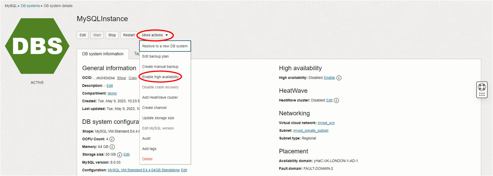
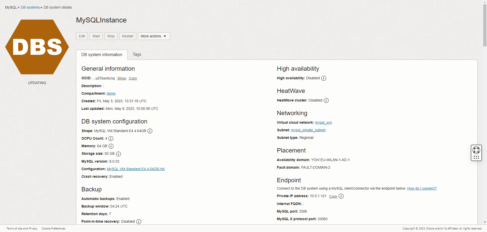

# oci-wordpress-mds

**[Previous lab](./wordpress_test_installation.md)**

## Introduction
When a system go live in production, it's important to prevent downtimes. Wordpress has its own ways to configure High Availability, we see here how to enable HA for MySQL.
 
## Improve the Business Continuity: enable the MySQL HeatWave Database Instance High Availability

<h3>Task 1 - Enable High Availability</h3>

1. Go to the OCI Dashboard

2. Navigate to the MySQL HeatWave database instances page. Make sure you are in the correct compartment for your database instance.

    

3. In the row that displays your database instance you will see that HA is not enabled.

    

4. To enable HA, click on your database instance's name and then in its details page (below) click on the "More Actions" button menu and select the "Enable High Availability" option.

    

5. Confirm the activation by clicking on "Enable"

    

6. By default, standalone and High Availability instances have different configuration settings. Choose the configuration "MySQL.VM.Standard.E4.4.64GB.HA" and press "Enable"

    

7. It requires some minutes to enable the HA, so wait until the end of the activity

    

8. While a change is in progress, you can navigate instance details, but you are not allowed to make changes.
    We can see it from the "UPDATING" (orange) status.

    

<h3>Task 2 - Test High Availability</h3>

1. Please check the MySQL HeatWave Database Service instance endpoint, and note that the Private IP address of your instance doesn't change enabling or disabling the High Availability

2. We can now simulate a failure, with the "switchover" option.
    From the Instance details page, open the "More actions" menu and choose

    

3. The wizard ask you which FD (Fault Domain) or AD (Availability Domain) to use.
    Choose one different from the actual and confirm with "SWitchover" button. Below example is for FD.

    

4. Even if the instance is in "UPDATE" (orange) status, it's still online. The downtime is limited to the seconds required to complete the switchover. Wait that the instance return to "ACTIVE" (green) status. The status change requires few minutes.

5. Return to your "My Restaurant" web site and navigate. YOu can see that the web site is still working perfectly

**[Next lab](./mds_read_replicas.md)**
