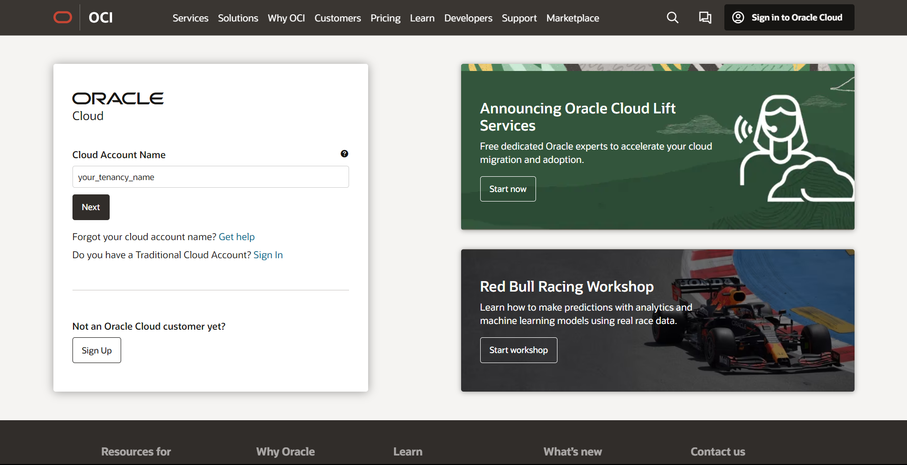
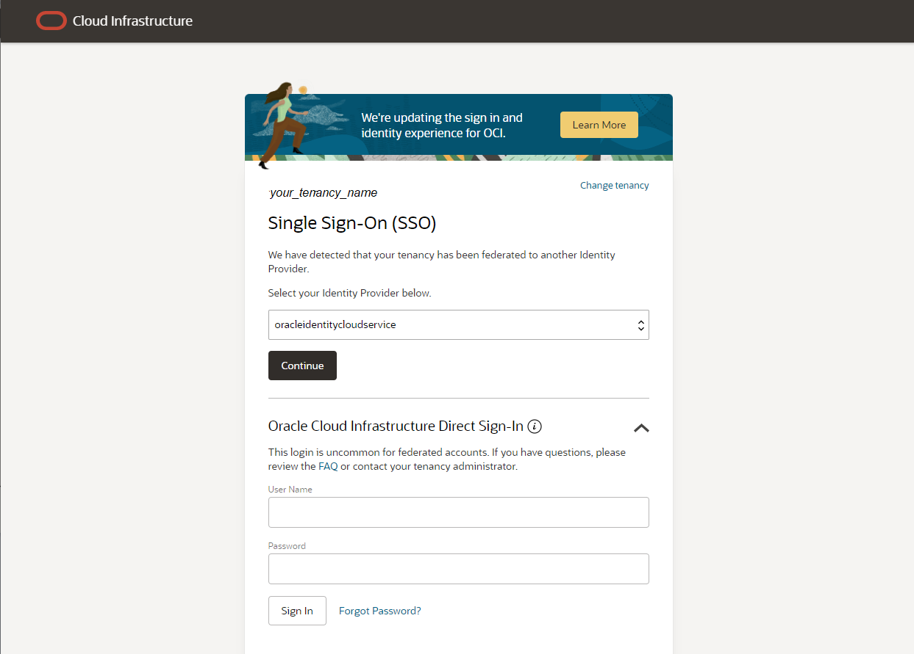

# oci-wordpress-mds

## Introduction
On one hand, MySQL is the world’s most popular open-source database. On the other, WordPress is the leading content management system. This step by step workshop will combine both technologies and will show and guide participants on running WordPress with MySQL HeatWave.

In this hands-on workshop, you will learn:

More about MySQL HeatWave
- Enabling MySQL HeatWave on Oracle Cloud
- Deploying a new website with WordPress and MySQL
- Growing from a small development environment to a full production architecture
- Scale your environment for any future load
- Making your architecture highly available

An Oracle Cloud account is required and enough privileges to 
- execute stacks
- create and manage network configurations
- create and manage compute machines
- create and manage MySQL HeatWave Database Instances
We recommend to use an administrative account and a dedicated compartment.

If you do not have an Oracle Account, you can claim an Oracle Cloud Free Trial account with FREE 300 USD credits [here](https://www.oracle.com/cloud/free/).

## Lab preparation
Deploy Wordpress on Oracle Cloud Intrastructure (OCI) and MySQL Database Service (MDS) using Terraform modules.

1. Use button below to start the stack

2. The script connect you to OCI login page.
Insert your tenancy name and click next

3. Expand **"Oracle Cloud Infrastructure Direct Sign-In"** and insert your username and password

4. The welcome stack ask you to insert the mandatory information
 